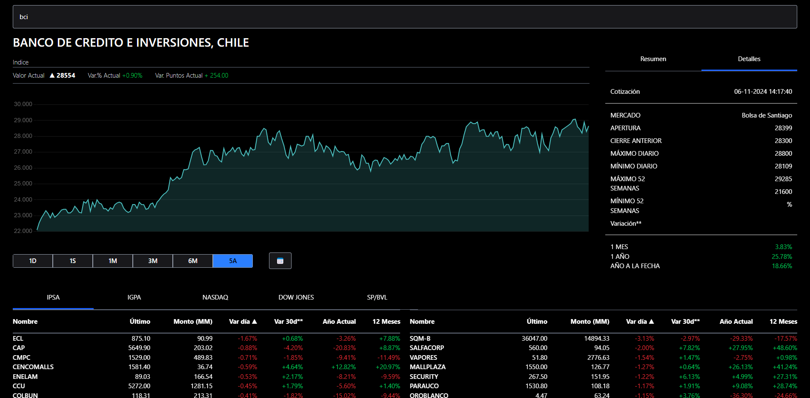

# 📊 Dashboard Financiero con Vue.js

[](https://vuejs.org/)
[](https://prueba-vuejs.vercel.app/)
[](https://jestjs.io/)

Aplicación web para visualizar datos financieros en tiempo real, desarrollada con Vue.js. 
Incluye gráficos interactivos, gestión de estado con Pinia y pruebas unitarias/integración.

 

## 🚀 Características Principales
- **Componentes reutilizables**: Arquitectura modular con 7 componentes independientes
- **Gestión de estado**: Centralizado con Pinia para sincronización en tiempo real
- **Gráficos interactivos**: Implementados con Chart.js y actualización dinámica
- **Búsqueda en tiempo real**: Filtrado instantáneo de instrumentos financieros
- **Testing**: cobertura con Jest y Vue Test Utils

## 🛠 Tecnologías Utilizadas
| Tecnología | Uso |
|------------|-----|
| Vue.js 3 | Framework principal |
| Pinia | Gestión de estado global |
| Tailwind CSS | Estilos y diseño |
| Chart.js | Visualización de gráficos |
| Jest | Pruebas unitarias |
| Vue Test Utils | Pruebas de componentes |
| Vercel | Despliegue continuo |

## 📦 Instalación Local
1. Clona el repositorio:
```bash
git clone https://github.com/jpundonor/prueba-vuejs.git
```
2. Instala dependencias:

```bash
npm install
```
3. Ejecuta el servidor de desarrollo:
```bash
npm run dev
```
4. Para pruebas:

```bash
npm run test:unit 
```

## 🎯 Demo en Vivo

Accede a la versión desplegada:

[👉 Ver Proyecto en Vercel](https://prueba-vuejs.vercel.app/)

## ✅ Pruebas Automatizadas

 


## 🏗 Estructura de Proyecto

```bash
src/  
├── assets/         # Estado global con Pinia
├── components/     # Componentes Vue
├── stores/         # Recursos estáticos
└── tests/          # Pruebas unitarias y de integración
```

Hecho con ❤️ por [Javier Rojas](https://javier-rojas.vercel.app/)